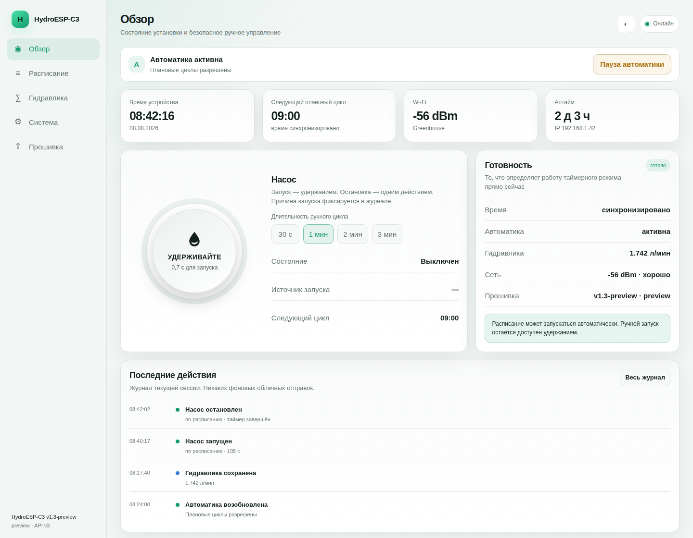
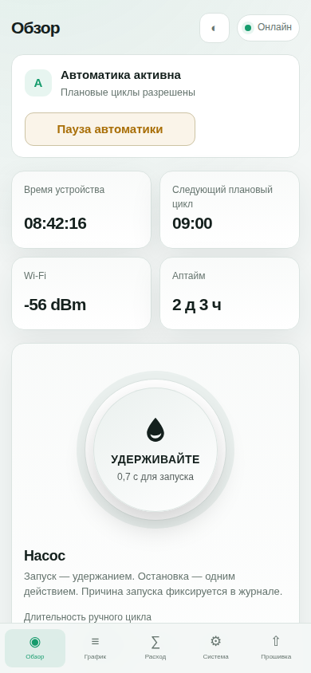

<div align="center">

# 🌱💧 HydroESP-C3

**Простой локальный контроллер полива на ESP32-C3 Super Mini**  
Расписание · ручной полив · обслуживание · калибровка · OLED · Web UI · OTA

[](https://github.com/f2re/hydro-esp-c3/actions/workflows/build.yml)


**Прошил → подключился к `HydroESP-Setup` → открыл `192.168.4.1` → выбрал домашний Wi‑Fi. Всё.**

</div>



> [!NOTE]
> Скриншоты сделаны из того же embedded Web UI, который компилируется в прошивку. Данные на них демонстрационные.

## 🚀 Установка за несколько минут

Нужны ESP32-C3 Super Mini, USB data-кабель, Python 3.9+ и Git. PlatformIO отдельно ставить не нужно.

```bash
git clone https://github.com/f2re/hydro-esp-c3.git
cd hydro-esp-c3
```

**macOS / Linux**

```bash
bash install.sh
```

**Windows PowerShell**

```powershell
.\install.ps1
```

После прошивки контроллер создаёт открытую локальную сеть:

```text
Wi‑Fi: HydroESP-Setup
Пароль: нет
Сайт: http://192.168.4.1
```

1. подключитесь к `HydroESP-Setup`;
2. откройте `http://192.168.4.1`;
3. укажите домашний Wi‑Fi;
4. контроллер перезагрузится;
5. откройте IP, показанный на OLED, либо `http://hydro.local`.

> [!IMPORTANT]
> Обычная команда `install` — это **чистая установка**. Она удаляет старые Wi‑Fi-настройки, чтобы устройство после прошивки гарантированно появилось как `HydroESP-Setup`. Для дальнейших обновлений используйте Web OTA или `python3 tools/hydroctl.py update` — они настройки не стирают.

📖 Подробно: [docs/INSTALL.md](docs/INSTALL.md) · Если сайт не виден: [docs/WEB_ACCESS.md](docs/WEB_ACCESS.md)

## ✨ Что умеет

| ⏱ Автоматика | 👆 Вручную | 🛠 Обслуживание |
|---|---|---|
| До 48 циклов в сутки | Hold-to-start | Пауза без удаления расписания |
| Локальная работа без облака | Stop одним нажатием | Калибровка без неожиданного автополива |
| Пропущенный цикл не «догоняется» | Ограничение времени запуска | Backup / restore / диагностика |

- 📅 редактируемое суточное расписание;
- 💧 ручное управление насосом;
- ⏸ режим обслуживания;
- 🧪 калибровка фактического расхода через мерную ёмкость;
- 📱 адаптивный desktop/mobile Web UI;
- 🌗 светлая, тёмная и системная темы;
- 🧾 журнал действий текущей сессии;
- 🩺 диагностика RAM / flash / reset reason;
- 💾 backup/restore без Wi‑Fi-пароля;
- ⬆️ обновление через браузер или `hydroctl`;
- 🖥 полный IP всегда виден на OLED и в Serial.

## 🖥 Интерфейс

<table>
<tr>
<td width="68%" valign="top">

### Desktop


</td>
<td width="32%" valign="top">

### Mobile



</td>
</tr>
</table>

### 🧪 Калибровка расхода


Мастер запускает короткие тесты насоса, вы вводите объём из мерной ёмкости, а контроллер считает фактический расход. Несколько повторов позволяют увидеть стабильность результата.

> [!IMPORTANT]
> Автоматика сейчас остаётся понятным таймерным контуром. Адаптивный полив имеет смысл добавлять только после появления реальных датчиков уровня/потока и окружающей среды.

## 🔌 Подключение

| Компонент | GPIO | Назначение |
|---|---:|---|
| Relay IN | `4` | насос |
| OLED SDA | `5` | I²C data |
| OLED SCL | `6` | I²C clock |
| LED | `8` | индикация |
| BOOT | `9` | удержание → ручной старт; при работе → stop |

> [!WARNING]
> Насос должен иметь нормальное отдельное питание/силовой драйвер. Если ESP32 перезагружается при старте насоса, исправляйте питание и ЭМС, а не расписание.

## 🔄 Установка и обновление — не одно и то же

| Действие | Команда | Настройки |
|---|---|---|
| Установить с нуля | `bash install.sh` / `.\install.ps1` | очищаются |
| Переустановить USB без очистки | `python3 tools/hydroctl.py install --keep-settings` | сохраняются |
| Обновить работающий контроллер | `python3 tools/hydroctl.py update` | сохраняются |
| Обновить через Web UI | раздел **Прошивка** | сохраняются |

Для ручного flasher в Release используется единый install-образ; внутренние bootloader/partition offsets пользователю выставлять не нужно.

## 🧰 Полезные команды

```bash
python3 tools/hydroctl.py doctor   # диагностика
python3 tools/hydroctl.py monitor  # Serial 115200
python3 tools/hydroctl.py status   # состояние
python3 tools/hydroctl.py pause    # пауза автоматики
python3 tools/hydroctl.py resume   # возобновить
python3 tools/hydroctl.py backup   # резервная копия
python3 tools/hydroctl.py update   # обновить
```

## 🌐 Если сайт не открывается

Сначала смотрите OLED. Он показывает полный адрес, например:

```text
WEB ADDRESS
192.168.1.57
```

Открывайте:

```text
http://192.168.1.57
```

`hydro.local` — только удобное имя и зависит от mDNS вашей сети. При первой настройке адрес всегда `http://192.168.4.1`.

## 🔓 Сеть без лишних барьеров

`HydroESP-Setup` намеренно открытая сеть **только для первичной локальной настройки**. Никаких device key, логинов или дополнительных паролей установки нет. После сохранения домашнего Wi‑Fi контроллер перестаёт работать в setup AP и переходит в вашу LAN.

Web API также рассчитан на доверенную домашнюю/лабораторную LAN. Не публикуйте порт контроллера напрямую в интернет.

## 🧱 Архитектура

```text
ESP32-C3
├── RelayController   насос + timeout
├── Scheduler         расписание + пауза
├── ConfigStorage     NVS
├── Wi‑Fi / NTP       STA или простой setup AP
├── EventLog          журнал текущей сессии
├── OLED / Serial     IP и локальная диагностика
└── AsyncWebServer
    ├── Web UI
    ├── API v3
    └── OTA
```

UI self-contained: внешние CDN/серверы для работы контроллера не нужны.

## 🧭 Дальше

- [x] простой USB install;
- [x] простой открытый setup AP;
- [x] Web UI desktop/mobile;
- [x] расписание + обслуживание;
- [x] калибровка расхода;
- [x] backup / OTA / диагностика;
- [ ] minimum-level interlock;
- [ ] live flow confirmation;
- [ ] T/RH + температура раствора;
- [ ] adaptive irrigation только после реальной обратной связи.

Roadmap: [issue #2](https://github.com/f2re/hydro-esp-c3/issues/2).

## 📚 Документация

- 🚀 [Установка](docs/INSTALL.md)
- 🌐 [Доступ к Web UI](docs/WEB_ACCESS.md)
- ⬆️ [Обновление и recovery](docs/UPDATE.md)
- 🩺 [Диагностика](docs/TROUBLESHOOTING.md)
- 📡 [HTTP API v3](docs/API.md)
- 🧱 [Архитектура](docs/ARCHITECTURE.md)
- 🧪 [Аудит](AUDIT.md)

---

<div align="center">

**MIT License** · ESP32-C3 · local-first 🌱

</div>
